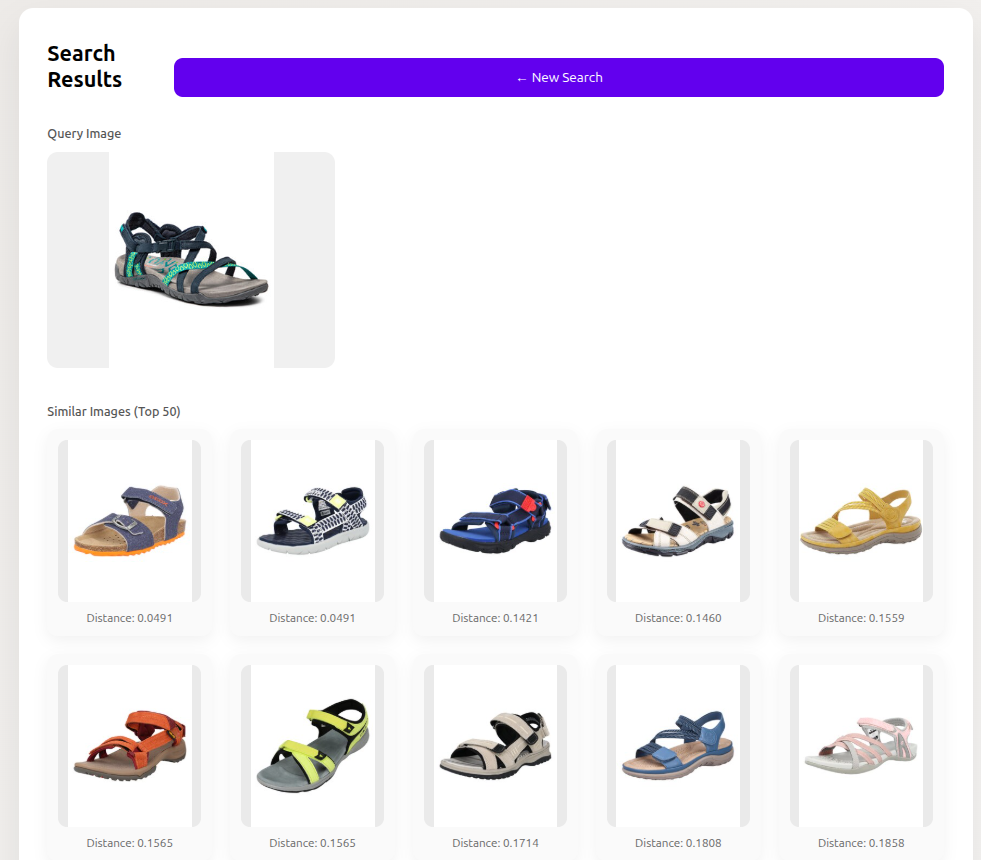
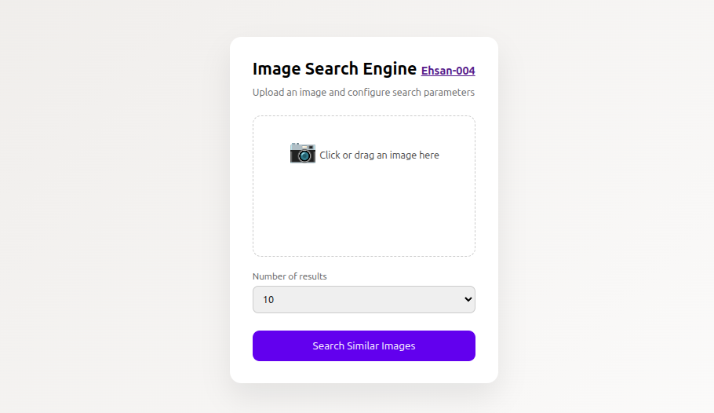

# Image similarity search system

[](https://github.com/Ehsan-004/FaceRecognition)
[](https://github.com/Ehsan-004/TinyUrler/blob/main/LICENSE)
[](https://github.com/Ehsan-004)
</br>

## A search engine based on a transformers
</br>

<div style="text-align: center;">



</div>

<br>

A scalable image-based search system for fashion products, designed to retrieve visually similar items in real time. <br>
The system uses **DINOv2** to extract 1024-dimensional image embeddings and stores them along with metadata in **ChromaDB**, while **FAISS** is used as the high-performance vector search engine. <br>
The system was evaluated on the **GLAMI dataset** containing over **900,000 fashion images**, achieving **sub-second retrieval time** while maintaining high visual similarity quality.<br>


<div style="text-align: center;">



</div>


## To use:
1. Read and create a parquet file like I did in data.ipynb
2. Run ```embedder.py``` and change the path of parquet file to create and save embeddings.
3. Run ```build_index.py``` to crete and save indexes of embeddings.
4. Run fast api back-end: ```fastapi dev App/main.py```
5. Go to ```localhost:8000```


<br>

## 🧑‍💻 Developer

- [Ehsan-004](https://github.com/Ehsan-004)

## 📜 License

This project is open-source and does not have a specific license. Feel free to use, modify, and distribute it as you see fit.
